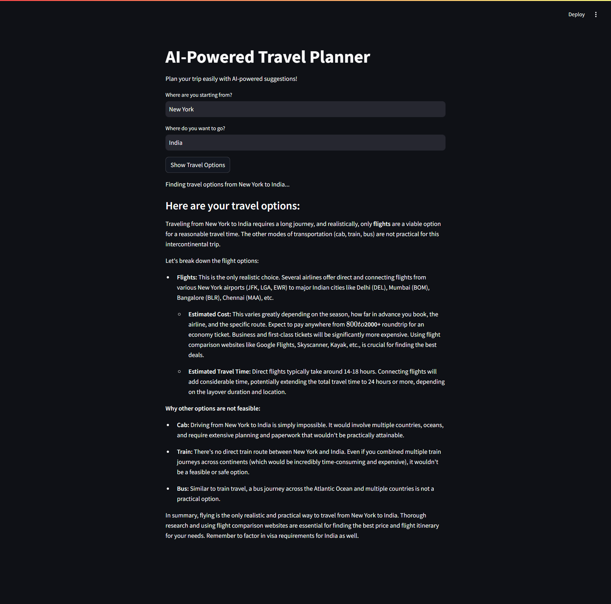

# 🌍 AI-Powered Travel Planner



## 🚀 Plan Your Trip with AI-Powered Suggestions!

This AI-driven travel assistant helps you find the best routes, estimated costs, and travel times for your journey. Powered by **Google Gemini AI** and **LangChain**, it provides **personalized** travel recommendations at your fingertips!

---

## 🛠️ Setup & Installation

### 1️⃣ Clone the Repository
```bash
git clone https://github.com/yourusername/ai-travel-planner.git
cd ai-travel-planner
```

### 2️⃣ Create a Virtual Environment
```bash
python -m venv venv
source venv/bin/activate  # On macOS/Linux
venv\Scripts\activate    # On Windows
```

### 3️⃣ Install Dependencies
```bash
pip install -r requirements.txt
```

### 4️⃣ Set Up Your API Key
Create a **.env** file in the project directory and add your Google API Key:
```plaintext
GOOGLE_API_KEY=your_google_generative_ai_api_key
```

---

## 🏃‍♂️ Running the App
```bash
streamlit run travel.py
```

This will launch the **AI-Powered Travel Planner** in your browser at `http://localhost:8501`.

---

## 🎯 Features
✅ AI-generated travel suggestions (cab, train, bus, flights)  
✅ Estimated travel cost & time  
✅ Real-time, dynamic responses  
✅ Easy-to-use Streamlit UI  
✅ Supports multiple locations worldwide  

---

## 📸 Screenshot

### 🔹 Sample Output:


---

## 🛠️ Troubleshooting
### ❌ Error: `Field required [type=missing]`
✅ Ensure your **.env** file is properly configured and the API key is valid.

### ❌ Error: `Unknown field for Candidate: text`
✅ Update the **Google Generative AI SDK**:
```bash
pip install --upgrade google-generativeai
```

---

## 🔮 Future Enhancements
- ✈️ **Real-time flight & train booking integration**
- 🌎 **Multi-destination trip planning**
- 🔥 **Voice-based assistant for travel recommendations**
- 📍 **Interactive maps & route visualization**

---

## 🤝 Contributing
We welcome contributions! Feel free to **fork** the repo and submit a **pull request**. Let's build a smarter travel assistant together! ✨

---

## 📜 License
This project is licensed under the **MIT License**.
